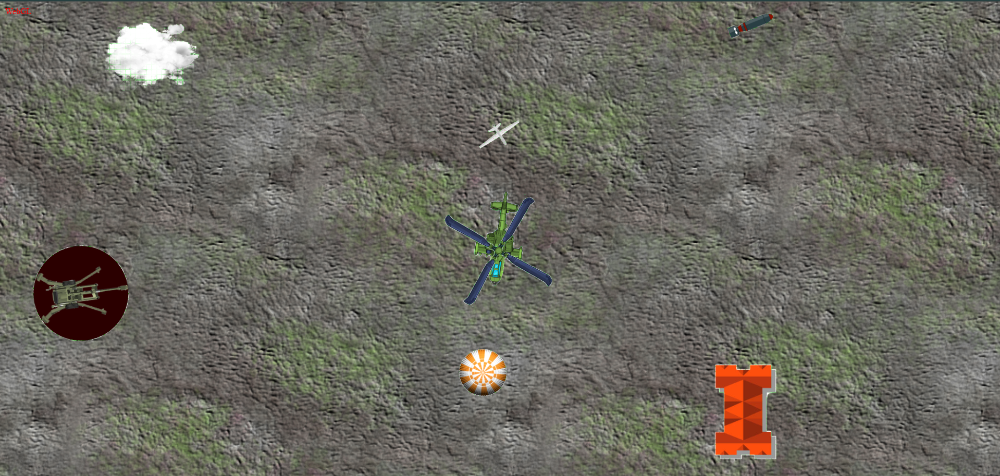
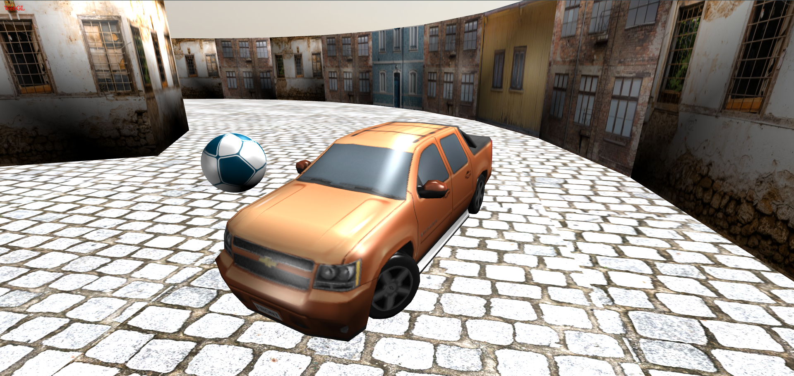
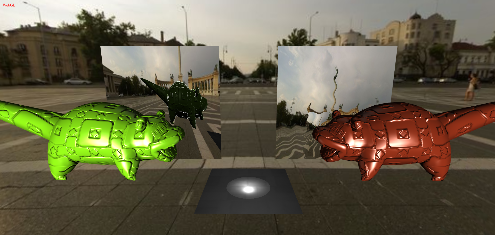
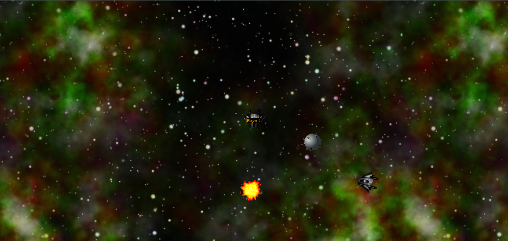
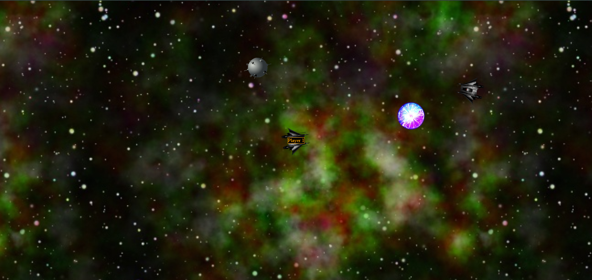
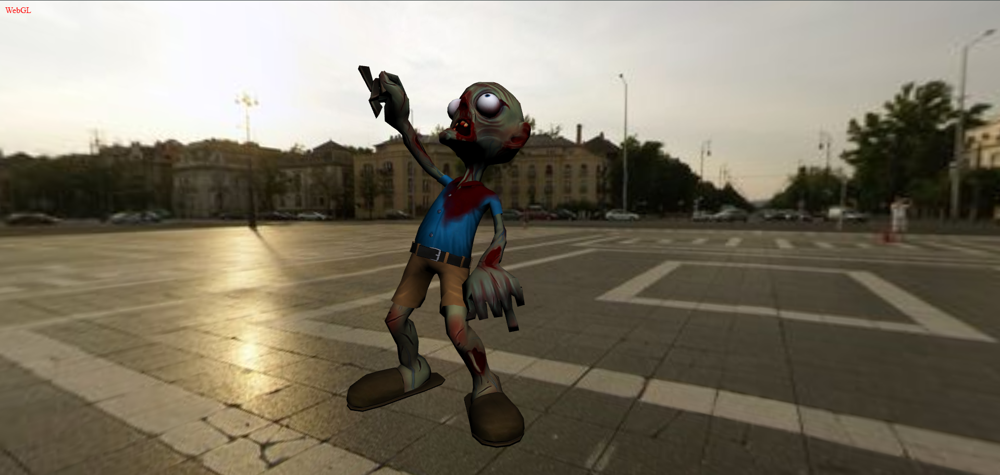

# WebGL Projects

## Required Tools

To run these projects, you will need the following software:

- **Java JDK 21** – required for building the projects
- **Gradle** – for managing the build process
- **http-server** – for running the built WebGL projects locally

---

## Building the Projects

To build a project:

1. Navigate to the project folder
2. Run the Gradle wrapper commands

```bash
gradlew build
gradlew jsNodeRun
```

---

## Running the Projects

If you just want to run a project without rebuilding it:

Install http-server (for example, via Node.js)

Run the run.bat file from the project folder
this will start a local server at the specified port number and open the project in your browser

---

## 2D Game

### Game Guide

In this game, you control a helicopter to deliver aid packages to three houses while a cannon continuously tries to stop you by dropping bombs.  

- **Controls:**  
  - `W`, `A`, `S`, `D` – move the helicopter  
  - `E` – instantly accelerate to maximum speed  
  - `SPACE` – launch an aid package 

Aid packages are delivered when they collide with a house. If the helicopter is hit by a bomb, it is destroyed, and the game can be restarted using the browser refresh button. The cannon fires a bomb every 3 seconds. Once all three houses have received their aid packages, the cannon disappears, and you win the game. If the helicopter flies too far, it will be reset to the starting position. A helper drone continuously follows the helicopter.



---

### Implemented Features

- **Avatar:** The helicopter, controlled by the player as described above  
- **Environment:** The helicopter, drone, aid packages, and clouds gradually lose momentum over time  
- **Projectiles:** Press `SPACE` to launch aid packages (one every 3 seconds). The cannon fires bombs every 3 seconds toward the helicopter  
- **Target Tracking:** The helicopter is followed by a drone 
- **Orientation:** The helicopter and drone always face the direction they are moving
- **Collision:** The helicopter can collide with bombs, destroying both objects. Aid packages collide with houses, disappearing upon delivery 
- **Bouncing:** Clouds act as bouncy objects in the game area  
- **Propeller:** The helicopter has a rotating propeller  
- **Camera:** The view follows the helicopter

---

## 3D Car Game

### Game Features

- **Helicopter Camera:** The camera follows a helicopter-like, physics-simulated object (not visible in-game). It is connected with spring-like forces and torques that keep it above and behind the avatar while facing toward it. The forces and torques provide smooth motion with proper damping  

- **Rollers:** Spherical, textured objects that roll without slipping. The car can push and interact with them  

- **Flippers:** Static objects along the edges of the track that bounce the car back with extra energy upon collision. Simple cylinder or sphere collision geometries are used  

- **Steering Wheels:** The car has wheels that rotate according to forward/backward movement. Some wheels can also steer around a vertical axis to change direction  



---

### Controls

- `W` – move forward  
- `S` – move backward  
- `A` – steer left  
- `D` – steer right  
- `C` – move camera up  
- `X` – move camera down  
- `E` – rotate camera around the car to the right  
- `Q` – rotate camera around the car to the left  

---

### Gameplay

The game takes place on a circular track bordered by houses. Collisions with the houses push the car back with a constant force, similar to interactions with the spherical objects on the track. There are three spheres on the track that the car can push, move, and roll around.

---

## Multipass Project

### Features

- **Spot Lighting:** The floor is illuminated by a spotlight from below  
- **Normal Mapping:** Two models (Slowpoke) use normal mapping for enhanced surface detail  
- **Reflective Objects:** Objects on the right side of the scene have reflective surfaces 
- **Rearview Mirror:** A reflective plane on the left side simulates a rearview mirror effect  



---

### Controls

- `W`, `A`, `S`, `D` – move the camera forward, left, backward, and right  
- `E`, `Q` – move the camera up and down  
- **Mouse:** Left-click and drag to rotate the camera

---

## Multiplayer Game

### Features

  This program is a multiplayer browser-based space combat game and 2D/3D graphics system built using Kotlin, Node.js, and WebGL. It features a robust networking architecture where game physics and state are managed on a    central server and synchronized across multiple clients
  Project Overview
  The core of the project is a server-side physics simulation that handles the movement and interaction of game objects (avatars, projectiles, mines) and broadcasts the state to all connected players

- **Spaceship Controls:**  
  - `W`, `A`, `S`, `D` – move forward, left, backward, and right  
  - `Q` – rotate right  
  - `E` – rotate left  
  - `SPACE` – fire projectiles  
  - `M` – place a mine  

- **Mines:**  
  - Mines activate 3 seconds after placement  
  - If a fighter is within 4 units of an active mine, the mine moves toward the fighter  
  - When a mine collides with a fighter, it explodes, disappears, and pushes the fighter  
  - Mines are harmless before activation  

- **Projectiles:**  
  - Projectiles disappear after 10 seconds  
  - Projectiles push fighters when they collide 
  - Projectiles interact with active mines, causing visible explosions and removing both the mine and the projectile 
  - Projectiles can also collide with other projectiles, creating visible explosions 

- **Explosions:**  
  - Visible explosions occur when:  
    - A projectile hits a fighter  
    - A projectile hits another projectile  
    - A projectile hits an active mine  
    - A fighter hits an active mine  
  - No visible explosion occurs when fighters collide with each other  

- **Physics Interactions:**  
  - Fighters are pushed when hit by projectiles or active mines 
  - Mines and projectiles are removed from the scene after collisions
 
- **How to run**
  - after installing the necessary softwares run the run_server.bat
  - open your browser and access the game at http://localhost:3001?name=YourName





---

## Character animation

  This program is a GPU-based character animation system that implements skeletal animation and skinning using Dual Quaternions.
  
  - **Project Overview**
  
  The program focuses on offloading the heavy calculations of character movement (interpolation and skinning) to the GPU through a specialized shader pipeline
  - **Key Components**
    - Model & Animation Loading: The system loads rigged geometry and animation data (skeleton and keyframes) from JSON files
    - GPU Resource Management: Animation data is stored in DataTextures, and transformations are managed using Framebuffers to handle dual quaternion data for nodes and bones
  - **Shader Pipeline**
    - Interpolation (interpolation-fs): Selects and interpolates node transformations from keyframes based on the current animation time
    - Transformation Chain (chain-fs): Combines rigging poses with node transformation chains to calculate final bone transformations
    - Skinning (skinning-vs): Performs Smooth Skinning by weighting bone transformations (using blendIndices and blendWeights) to transform mesh vertices in real-time

  

---

## Texture

  WebGL Sprite Animation System
  A Kotlin-based WebGL application that demonstrates dynamic sprite sheet manipulation and state-based animation.
  - **Sprite Sheet Mapping**
    -  Efficiently renders specific frames from an 8x8 texture grid (platformer_sprites_base.png)
  - **Dynamic Animation States**
    - Run (F key): Faster animation playback
    - Walk (S key): Slower animation playback
    - Stop (SPACE): Pauses the animation
 - **GPU-Accelerated Rendering**
   -  Uses custom shaders (idle-vs.glsl, solid-fs.glsl) to handle sprite offsets and scaling directly on the GPU for high performance
• **Real-time Input**
   Listens for keyboard events to toggle between animation phases and movement speeds


---
